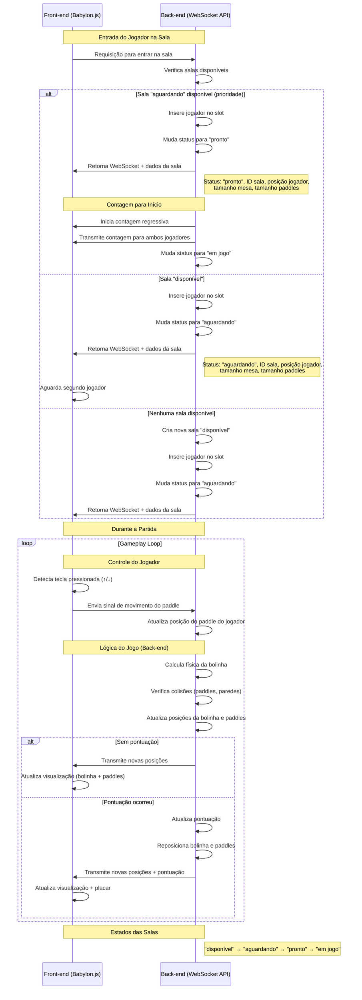

```mermaid
sequenceDiagram
    participant F as Front-end (Babylon.js)
    participant B as Back-end (WebSocket API)

    Note over F,B: Entrada do Jogador na Sala
    F->>B: Requisição para entrar na sala
    B->>B: Verifica salas disponíveis

    alt Sala "aguardando" disponível (prioridade)
        B->>B: Insere jogador no slot
        B->>B: Muda status para "pronto"
        B->>F: Retorna WebSocket + dados da sala
        Note right of B: Status: "pronto", ID sala, posição jogador,<br/>tamanho mesa, tamanho paddles

        Note over F,B: Contagem para Início
        B->>F: Inicia contagem regressiva
        B->>F: Transmite contagem para ambos jogadores
        B->>B: Muda status para "em jogo"

    else Sala "disponível"
        B->>B: Insere jogador no slot
        B->>B: Muda status para "aguardando"
        B->>F: Retorna WebSocket + dados da sala
        Note right of B: Status: "aguardando", ID sala, posição jogador,<br/>tamanho mesa, tamanho paddles
        F->>F: Aguarda segundo jogador

    else Nenhuma sala disponível
        B->>B: Cria nova sala "disponível"
        B->>B: Insere jogador no slot
        B->>B: Muda status para "aguardando"
        B->>F: Retorna WebSocket + dados da sala
    end

    Note over F,B: Durante a Partida

    loop Gameplay Loop
        Note over F,B: Controle do Jogador
        F->>F: Detecta tecla pressionada (↑/↓)
        F->>B: Envia sinal de movimento do paddle
        B->>B: Atualiza posição do paddle do jogador

        Note over F,B: Lógica do Jogo (Back-end)
        B->>B: Calcula física da bolinha
        B->>B: Verifica colisões (paddles, paredes)
        B->>B: Atualiza posições da bolinha e paddles

        alt Sem pontuação
            B->>F: Transmite novas posições
            F->>F: Atualiza visualização (bolinha + paddles)

        else Pontuação ocorreu
            B->>B: Atualiza pontuação
            B->>B: Reposiciona bolinha e paddles
            B->>F: Transmite novas posições + pontuação
            F->>F: Atualiza visualização + placar
        end
    end

    Note over F,B: Estados das Salas
    Note right of B: "disponível" → "aguardando" → "pronto" → "em jogo"

```